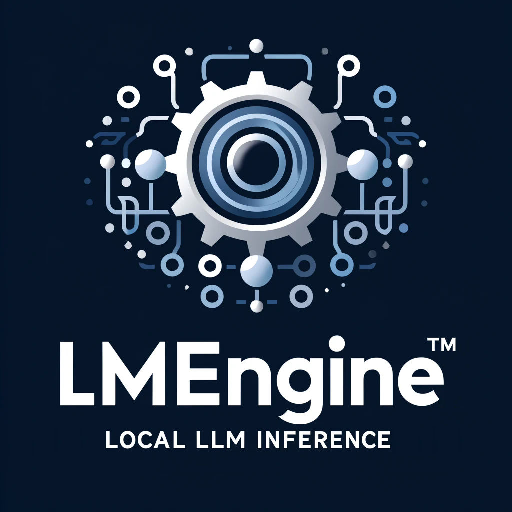

[](https://discord.gg/tPWjMwK) [](https://twitter.com/tinyBigGAMES)
# LMEngine
###  Overview
Welcome to LMEngine. We are pleased to introduce you to our versatile and user-friendly library, designed to facilitate local LLM inference across various programming languages. Whether you are a seasoned developer or just beginning your journey, LMEngine offers a         straightforward solution to integrate advanced language model capabilities into your applications with ease.

This library efficiently loads LLMs in [GGUF format](https://huggingface.co/docs/hub/gguf) into CPU or GPU memory, utilizing a [Vulkan backend](https://en.wikipedia.org/wiki/Vulkan) for enhanced processing speed.

###  Installation
- [Download](https://github.com/tinyBigGAMES/LMEngine/archive/refs/heads/main.zip) the LMEngine repo, unzip to a desired location.
- Acquire a GGUF model. All vetted models compatible with LMEngine can be downloaded from our <a href="https://huggingface.co/tinybiggames" target="_blank">Hugging Face</a> account.
- The application utilizes Vulkan for enhanced performance on supported GPUs. You can perform inference solely on the CPU or distribute the workload between the CPU and GPU to accommodate scenarios with limited VRAM (this split functionality will be available in a future update). Ensure the model size does not exceed the available system resources, considering the requisite memory.
- Consult the `installdir\examples` directory for demonstrations on integrating **LMEngine** with your programming language.
- Include the following DLLs in your project distribution: `LMEngine.dll`. See [VirusTotal Report](bin/LMEngine.dll.VirusTotal.txt) report.
- LMEngine API supports integration across programming languages that accommodate Win64 and Unicode, with out-of-the-box support for Pascal and C/C++.
- Ship-ready DLLs are included in the repository; however, if there is a need to rebuild the `LMEngine.dll`, [RAD Studio 12.1](https://www.embarcadero.com/products/rad-studio/) is required.
- This project is developed using RAD Studio 12.1, on Windows 11, powered by an Intel Core i5-12400F at 2500 MHz with 6 cores (12 logical), equipped with 36GB RAM and an NVIDIA RTX 3060 GPU with 12GB RAM.

- We encourage testing and welcome pull requests.
- If you find this project beneficial, please consider starring the repository, sponsoring, or promoting it. Your support is invaluable and highly appreciated.

###  Examples  
Pascal example:
```Pascal   
uses
  SysUtils,
  LMEngine;

begin
  // init
  Config_Init('C:/LLM/gguf', -1);
  
  // define model
  Model_Define('phi-3-mini-4k-instruct.Q4_K_M.gguf', 'phi-3-mini-4k-instruct.Q4_K_M', 4000, '<|{role}|>{content}<|end|>', '<|assistant|>');  
  
  // add message
  Message_Add(ROLE_SYSTEM, 'You are a helpful AI assistant');
  Message_Add(ROLE_USER, 'What is AI?');
    
  if not Model_Load('phi-3-mini-4k-instruct.Q4_K_M') then
  begin
    Console_PrintLn('Error: %s', FG_RED, Error_Get());
    Exit;
  end;    
    
  // do inference
  if Inference_Run('phi-3-mini-4k-instruct.Q4_K_M', 1024) then
    begin
      // success
    end
  else
    begin
      // error
    end;

  // unload model  
  Model_Unload();

end.
```  
C/CPP Example  
```CPP  
#include <Infero.h>

int main()
{
    // init
    Config_Init("C:/LLM/gguf", -1);
    
    // define model
    Model_Define("phi-3-mini-4k-instruct.Q4_K_M.gguf", "phi-3-mini-4k-instruct.Q4_K_M", 4000, "<|{role}|>{content}<|end|>", "<|assistant|>");  
    
    // add message
    Message_Add(ROLE_SYSTEM, "You are a helpful AI assistant");
    Message_Add(ROLE_USER, "What is AI?");
    
    if (!Model_Load("phi-3-mini-4k-instruct.Q4_K_M"))
    {
        Console_PrintLn("Error: %s", FG_RED, Error_Get());
        return 1;
    }
    
    // do inference
    if (Inference_Run('phi-3-mini-4k-instruct.Q4_K_M', 1024))
    {
        // success
    }
    else
    {
        // error
    }
    
    // unload model  
    Model_Unload();

    return 0;
}
```

###  Media

LMEngine in C/C++

https://github.com/tinyBigGAMES/LMEngine/assets/69952438/28a4fb0e-8c65-4980-81b6-181a2b7df57a

LMEngine in Pascal

https://github.com/tinyBigGAMES/LMEngine/assets/69952438/49fa3147-3fd7-4903-8b4a-cfeb4db08ca9


###  Support
Our development motto: 
- We will not release products that are buggy, incomplete, adding new features over not fixing underlying issues.
- We will strive to fix issues found with our products in a timely manner.
- We will maintain an attitude of quality over quantity for our products.
- We will establish a great rapport with users/customers, with communication, transparency and respect, always encouragingng feedback to help shape the direction of our products.
- We will be decent, fair, remain humble and committed to the craft.

###  Links
- <a href="https://github.com/tinyBigGAMES/LMEngine/issues" target="_blank">Issues</a>
- <a href="https://github.com/tinyBigGAMES/LMEngine/discussions" target="_blank">Discussions</a>
- <a href="https://www.facebook.com/groups/lmengine" target="_blank">Facebook Group</a>
- <a href="https://discord.gg/tPWjMwK" target="_blank">Discord</a>
- <a href="https://www.reddit.com/r/LMEngine/" target="_blank">Reddit</a>
- <a href="https://youtube.com/tinyBigGAMES" target="_blank">YouTube</a>
- <a href="https://twitter.com/tinyBigGAMES" target="_blank">X (Twitter)</a>
- <a href="https://tinybiggames.com/" target="_blank">tinyBigGAMES</a>


###  License
LMEngine is a community-driven project created by <a href="https://github.com/tinyBigGAMES" target="_blank">tinyBigGAMES LLC</a>.

BSD-3-Clause license - Core developers:
- <a href="https://github.com/jarroddavis68" target="_blank">Jarrod Davis</a>

###  Acknowledgments
LMEngine couldn't have been built without the help of wonderful people and great software already available from the community. **Thank you!**

Software
- [llama.cpp](https://github.com/ggerganov/llama.cpp). 

People
- John Claw
- Robert Jalarvo

